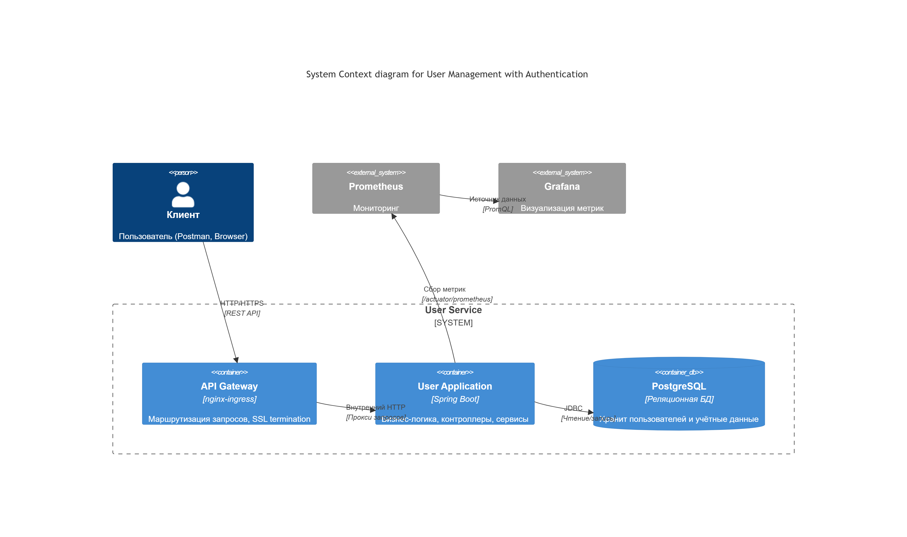
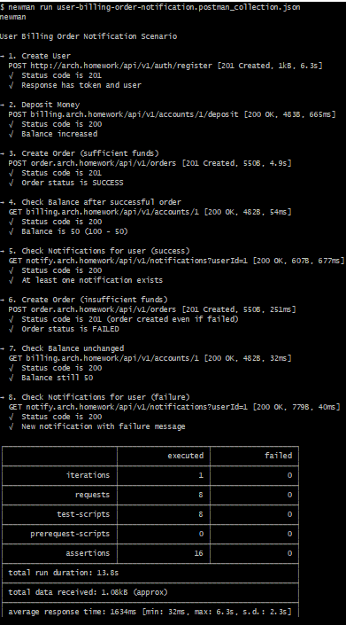

# Микросервисное приложение: User / Billing / Notification / Order

Данный проект реализует систему управления пользователями, биллингом, заказами и уведомлениями в соответствии с заданием.  
Взаимодействие между сервисами построено на синхронных HTTP‑вызовах (REST).

---

## Содержание

- [Архитектура решения](#архитектура-решения)
- [Предварительные требования](#предварительные-требования)
- [Установка](#установка)
    - [1. Установка PostgreSQL](#1-установка-postgresql)
    - [2. Установка Ingress Controller](#2-установка-ingress-controller)
    - [3. (Опционально) Prometheus и Grafana](#3-опционально-prometheus-и-grafana)
    - [4. Сборка и публикация Docker‑образов](#4-сборка-и-публикация-dockerобразов)
    - [5. Установка микросервисов](#5-установка-микросервисов)
- [Проверка работоспособности](#проверка-работоспособности)
- [Тестирование](#тестирование)
    - [Postman‑коллекция](#postmanколлекция)
    - [Результат выполнения тестов](#результат-выполнения-тестов)
- [Нагрузочное тестирование (k6)](#нагрузочное-тестирование-k6)

---

## Архитектура решения

Общая схема взаимодействия сервисов и диаграмма последовательности для сценария создания заказа представлены ниже:

| Общая архитектура | Диаграмма последовательности (создание заказа) |
|-------------------|-------------------------------------------------|
|  |  |

**Описание взаимодействия при создании заказа:**

1. Пользователь отправляет запрос `POST /api/v1/orders` в сервис **Order**.
2. Сервис **Order** вызывает `POST /api/v1/accounts/{userId}/withdraw` в сервисе **Billing** для списания средств.
3. В зависимости от ответа Billing:
    - если списание успешно – статус заказа `SUCCESS`, иначе `FAILED`.
4. **Order** сохраняет заказ в своей БД.
5. **Order** отправляет уведомление в сервис **Notification** (`POST /api/v1/notifications`).
6. **Notification** сохраняет уведомление в своей БД и возвращает статус.

Все сервисы используют общую базу данных PostgreSQL (отдельные схемы/базы), развёрнутую в кластере Kubernetes.

---

## Предварительные требования

- Установленный [Minikube](https://minikube.sigs.k8s.io/docs/start/) или рабочее Kubernetes‑окружение.
- Установленный [Helm](https://helm.sh/docs/intro/install/) (версия 3.x).
- Установленный `kubectl`.
- Для сборки образов – Docker.
- Для тестирования – [Newman](https://learning.postman.com/docs/running-collections/using-newman-cli/command-line-integration-with-newman/) (или Postman) и [k6](https://k6.io/docs/get-started/installation/).

Убедитесь, что Minikube запущен:
```bash
minikube start
```

## Установка
Все компоненты устанавливаются в namespace microservices.
Ingress‑контроллер размещается в namespace ingress-nginx.

### 1. Установка PostgreSQL
Добавим репозиторий Bitnami и установим PostgreSQL без постоянного хранилища (для тестового окружения).

```bash
helm repo add bitnami https://charts.bitnami.com/bitnami
```
Обновим при необходимости
```bash
helm repo update
```
Создаем нэймспэйс
```bash
kubectl create namespace microservices
```
Установка PostgreSQL
```bash
helm install postgres bitnami/postgresql -n microservices \
  --set auth.database=user_db \
  --set auth.username=postgres \
  --set auth.password=postgres \
  --set primary.persistence.enabled=false \
  --set volumePermissions.enabled=true
```

Дождёмся, пока под PostgreSQL перейдёт в состояние Running:

```bash
kubectl get pods -n microservices -w
```

После этого создадим дополнительные базы данных для сервисов billing, notification и order:

```bash
# Получим имя пода PostgreSQL
POD_NAME=$(kubectl get pods -n microservices -l app.kubernetes.io/name=postgresql -o jsonpath="{.items[0].metadata.name}")

# Подключимся к поду и выполним SQL
kubectl exec -n microservices -it $POD_NAME -- bash -c "psql -U postgres <<EOF
CREATE DATABASE billing_db;
CREATE DATABASE notification_db;
CREATE DATABASE order_db;
EOF"
```

### 2. Установка Ingress Controller
Установим NGINX Ingress Controller с включёнными метриками для Prometheus.

```bash
# Добавим репозиторий ingress-nginx
helm repo add ingress-nginx https://kubernetes.github.io/ingress-nginx
```

```bash
# Обновим при необходимости
helm repo update
```

### Создадим namespace
```bash
kubectl create namespace ingress-nginx --dry-run=client -o yaml | kubectl apply -f -
```

### Установим ingress-nginx
```bash
helm install ingress-nginx ingress-nginx/ingress-nginx \
  --namespace ingress-nginx \
  --set controller.metrics.enabled=true \
  --set controller.metrics.serviceMonitor.enabled=true \
  --set controller.metrics.serviceMonitor.additionalLabels.release="prometheus" \
  --set controller.podAnnotations."prometheus\.io/scrape"="true" \
  --set controller.podAnnotations."prometheus\.io/port"="10254"
```

Если вы используете Minikube, пробросьте туннель, чтобы получить внешний IP для ingress:

```bash
minikube tunnel
```

### 3. Prometheus и Grafana
Для мониторинга нужно развернуть Prometheus и Grafana из чартов, находящихся в директории user/charts.

```bash
# Установка Prometheus
helm install prometheus ./user/charts/prometheus -n microservices
```

```bash
# Установка Grafana
helm install grafana ./user/charts/grafana -n microservices
```

После установки Grafana будет доступна по адресу http://grafana.arch.homework (если настроен ingress). 
Логин/пароль по умолчанию: admin / admin (при первом входе потребуется сменить).

### 4. Сборка и публикация Docker‑образов
Пересоберите образы микросервисов и загрузите их на Docker Hub (или другой registry).

```bash
# Сборка
docker build -t you_registry/user-app:latest ./user
docker build -t you_registry/billing-app:latest ./billing
docker build -t you_registry/notification-app:latest ./notification
docker build -t you_registry/order-app:latest ./order
```
Можно сразу скачать готовые
```bash
# Публикация
docker push victor2023victorovich/user-app:latest
docker push victor2023victorovich/billing-app:latest
docker push victor2023victorovich/notification-app:latest
docker push victor2023victorovich/order-app:latest
```

### 5. Установка микросервисов
Установите каждый сервис с помощью Helm, используя подготовленные чарты.
Важно: перед установкой убедитесь, что в файлах values.yaml всех сервисов указаны корректные ссылки на образы (ваш registry) и параметры подключения к БД (они уже настроены на использование сервиса postgres-postgresql внутри namespace microservices).

```bash
# Установка сервиса пользователей
helm install user ./user/charts/user-app -n microservices
```
```bash
# Установка биллинга
helm install billing ./billing/charts/billing -n microservices
```
```bash
# Установка уведомлений
helm install notification ./notification/charts/notification -n microservices
```
```bash
# Установка заказов
helm install order ./order/charts/order -n microservices
```
При необходимости обновления используйте helm upgrade --install ... с теми же параметрами.

## Проверка работоспособности
После установки проверьте состояние подов и сервисов:

```bash
kubectl get pods -n microservices
```
```bash
kubectl get svc -n microservices
```
```bash
kubectl get ingress -n microservices
```

Все поды должны быть в статусе Running.
Логи можно посмотреть командой:

```bash
kubectl logs -n microservices -l app=user-app
```
```bash
kubectl logs -n microservices -l app=billing-app
```
```bash
kubectl logs -n microservices -l app=notification-app
```
```bash
kubectl logs -n microservices -l app=order-app
```

Проверьте доступность приложений через ingress.
Добавьте в файл hosts (или используйте minikube tunnel) следующие домены:

arch.homework → user‑service

billing.arch.homework → billing‑service

notify.arch.homework → notification‑service

order.arch.homework → order‑service

Пример проверки через curl:

```bash
curl http://arch.homework/api/v1/users
```

## Тестирование
### Postman‑коллекция
Для функционального тестирования подготовлена коллекция Postman, покрывающая полный сценарий:

создание пользователя

пополнение счёта

создание заказа с достаточными средствами

проверка баланса и уведомления

создание заказа с недостаточными средствами

повторная проверка баланса и уведомления

Коллекция находится в файле user-billing-order-notification.postman_collection.json.
Переменная окружения baseUrl по умолчанию указывает на http://arch.homework.

### Результат выполнения тестов
Запустите коллекцию с помощью Newman:

```bash
newman run user-billing-order-notification.postman_collection.json
```
Ниже представлен скриншот успешного прохождения всех тестов:



## Заключение
Все сервисы успешно разворачиваются в Kubernetes, взаимодействуют через HTTP, проходят функциональные тесты
