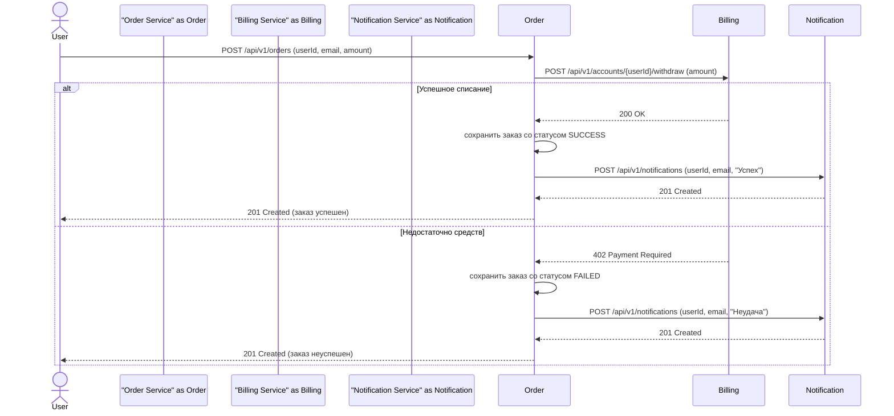

```mermaid
sequenceDiagram
    actor User
    participant "Order Service" as Order
    participant "Billing Service" as Billing
    participant "Notification Service" as Notification

    User->>Order: POST /api/v1/orders (userId, email, amount)
    Order->>Billing: POST /api/v1/accounts/{userId}/withdraw (amount)

    alt Успешное списание
        Billing-->>Order: 200 OK
        Order->>Order: сохранить заказ со статусом SUCCESS
        Order->>Notification: POST /api/v1/notifications (userId, email, "Успех")
        Notification-->>Order: 201 Created
        Order-->>User: 201 Created (заказ успешен)
    else Недостаточно средств
        Billing-->>Order: 402 Payment Required
        Order->>Order: сохранить заказ со статусом FAILED
        Order->>Notification: POST /api/v1/notifications (userId, email, "Неудача")
        Notification-->>Order: 201 Created
        Order-->>User: 201 Created (заказ неуспешен)
    end
```