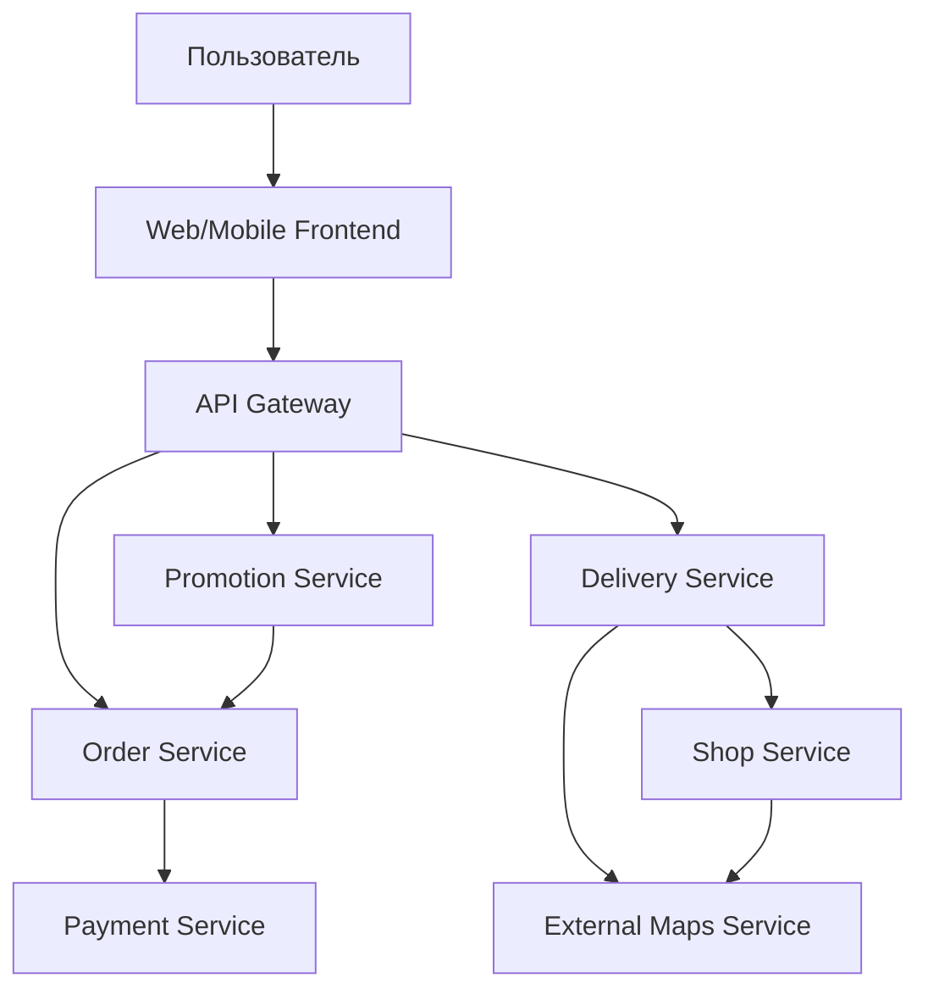

# Декомпозиция микросервисов для интернет-магазина сэндвичей

## 1. Пользовательские сценарии

1. **Размещение заказа**
    - Пользователь выбирает сэндвич, добавляет ингредиенты, выбирает магазин.
    - Система рассчитывает стоимость, применяет акции, принимает оплату.
    - Пользователь получает время готовности и адрес магазина с маршрутом.

2. **Обработка доставки**
    - Если выбран вариант доставки, система назначает водителя и отслеживает доставку.

3. **Управление акциями**
    - Администратор добавляет национальные/локальные акции. Пользователь видит акции в своём регионе.

4. **Интеграция с картами**
    - Система взаимодействует с внешними сервисами (Google Maps) для построения маршрута.

---

## 2. Схема взаимодействия сервисов (C4 Model, контейнерная диаграмма)

## 3. Описание микросервисов (шаблон Microservices Canvas)

###   Order Service
####   Назначение: 
   Обработка заказов, корзина, оплата.

####   Зона ответственности:
   
   Создание и валидация заказов.
   
   Интеграция с Payment Service.
   
   Расчет стоимости с учётом акций.
   
####   Контракты:
   
######   Запросы: Получение акций от Promotion Service.
   
######   Команды: CreateOrder, ProcessPayment.
   
######   События: OrderCreated, PaymentProcessed.
   
###   Delivery Service
####   Назначение: 
   Управление доставкой и логистикой.
   
####   Зона ответственности:
   
   Назначение водителей.
   
   Отслеживание доставки.
   
####   Контракты:
   
######   Запросы: Получение данных о магазине от Shop Service.
   
######   События: DeliveryScheduled, DriverAssigned.
   
###   Promotion Service

####   Назначение: 
   Управление акциями.
   
####   Зона ответственности:
   
   Хранение национальных и локальных акций.
   
####   Контракты:
   
######   Запросы: GetPromotionsByRegion.
   
######   События: PromotionUpdated.
   
###   Shop Service

####   Назначение: 

   Информация о магазинах.
   
####   Зона ответственности:
   
   Данные о местоположении и времени работы.
   
####   Контракты:
   
######   Запросы: GetShopAddress.
   
###   Payment Service

####   Назначение: 

   Обработка платежей.
   
####   Зона ответственности:
   
   Интеграция с PayPal/Stripe.
   
####   Контракты:
   
######   Команды: ProcessPayment.
   
######   События: PaymentCompleted.
   
###   External Maps Service

####   Назначение: 
   Интеграция с картографическими сервисами.
   
####   Зона ответственности:
   
   Построение маршрутов.
   
####   Контракты:
   
######   Запросы: GetRoute(shopAddress, userAddress).

## 4. Паттерн декомпозиции
   
Использован Паттерн декомпозиции по бизнес-возможностям (Business Capability Pattern).

#### Преимущества:

Гибкость при масштабировании.

Независимость сервисов.

Четкое разделение доменных правил.

